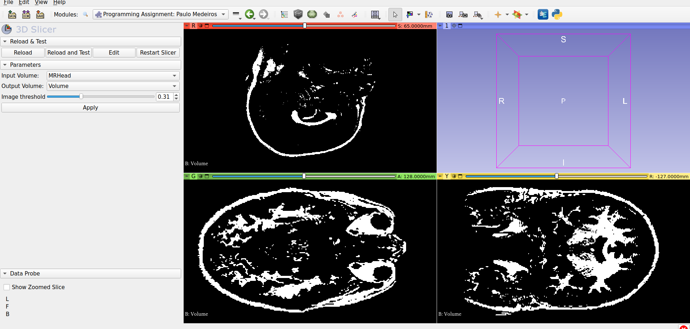

# Plugin de segmentação binária por threshold

Plugin para segmentação binária pro threshold de volumes `ScalarVolumeNode` do Slicer.

A implementação do plugin foi realizada principalmente através das classes:
- `ProgrammingAssignmentPauloMedeirosWidget`
  - Responsável pela GUI do plugin, por onde dados de entrada serão inseridos e validados. Implementa a responsividade após o clique do botão `Apply`, executando o algoritmo de segmentação, interagindo com a GUI e carregando o volume calculado na tela.

- `ProgrammingAssignmentPauloMedeirosLogic`
  - Responsável pela lógica do algoritmo de binarização do volume de entrada enquanto valida argumentos de entada. O algoritmo foi implementado seguindo os passos:
    - Criação de um `vtkImageData` com mesma dimensão do volume de entrada
    - Inicialização dessa imagem com 0 (preto)
    - Cálculo do valor de threshold em função da distribuição dos valores da imagem de input (dentro de min/max)
    - Atribuição de 1 (branco) somente para pixels com valores maiores a esse threshold

- `ProgrammingAssignmentPauloMedeirosTest`
  - Responsável pelos testes do plugin desenvolvido. É possível executar ao (Ativar modo desenvolvedor | Testing > Self Tests)
  - Testes implementados:
    - Argumentos de volume inválidos: nulos, mesmo volume de entrada e saída
    - Argumento de threshold inválido: fora do intervalo `[0;1]`
    - Valores do volume de saída corretamente calculado dentro do conjunto `{0,1}`

## Pontos de melhora
Não possuo nenhuma experiência prévia com a ferramenta Slider ou biblioteca `vtk`, então o plugin foi construído somente a partir da observação de exemplos e leitura da documentação e fórum.
Acredito que a GUI atende todos os requisitos da tarefa e que a performance (em tempo) da segmentação é aceitável, já que os únicos passos realizados (alocação, inicialização e aplicação de threshold) são necessários na execução do algoritmo.

Em memória, como a imagem de saída é binarizada, o tipo de dado do volume de saída poderia ser otimizado, já que somente 1 bit é necessário por pixel, ao invés de 1 byte do `VTK_UNSIGNED_CHAR`.

  
